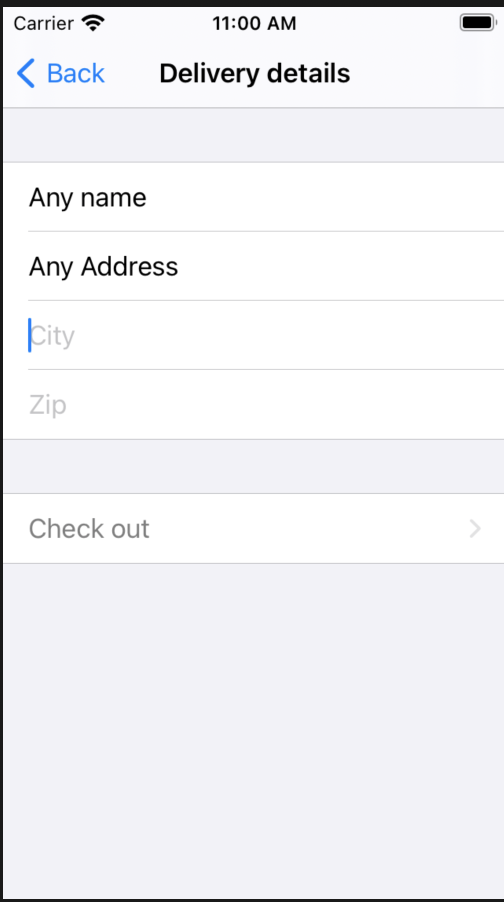

# Hacking-With-SwiftUI

## About
A set of projects based on Paul Hudson's [Hacking with iOS SwiftUI tutorials](https://www.hackingwithswift.com/books/ios-swiftui)

## Learning Objectives
* Gain an understanding of Imperative vs Declerative programming
* Explore SwiftUI's new form of programming
* Gain an understanding of how wrappers such as @Observable, @Publisher, @State ... etc work
* How data can be transfered from one view to another
* How to share an object to other views
* How to integrate UIKit objects into SwiftUI
* And so much more

## Usage

If you'd like to test any of these apps out, choose any folder you're curious about.
Once selected, launch the project in Xcode and run it on an iOS simulator. 
Some apps might not be able to run on a simulator due to a lack of required hardware, if so 
try it out on a physical iOS device.

Here's a list of apps you can checkout!

## BookWorm

Do you have a book you really enjoyed? We'll this app is a great for expressing your thoughts on a book!
Add it to your list, categorize it, rate it and comment. Do you feel like you were too harsh on your comment? No worries!
You can view your comment and edit the harsh words out!

| Add                                | Track                                    | Remove                                  | View                                 |
:-----------------------------------:|:----------------------------------------:|:---------------------------------------:|:------------------------------------:|
| Add a book and give it a rating    |  Keep track of your personal list!       |  Modify you list whenever you'd like    | Get a better view on your comments   |
| |   |  | |

## BucketList

Do you have a bucket list of places you'd like to visit? This is the app for you. To help you get a better view of your ambition, you'll have the ability to use
Apple's map view. Pin down any place of your interest, comment your goal for the place, see what place you can visit nearby! All of this in one app

| Add                                | Track                                    | Remove                                         | View                                   |
:-----------------------------------:|:----------------------------------------:|:----------------------------------------------:|:--------------------------------------:|
| Pin a place of your interest       | Keep track of all your bucket list places|  Change of mind? no problem, you can delete it!| Take a look at a list of nearby places |
|   |       |           | . |

## CupcakeCorner

Welcome to the cupcake corner shop. In this app you can make a quick order, choose any of the four flavors and add special toppings. Once you feel ready to beggin your
order, place your order and we'll deliver it to your place!

| Place order                            | Select options                               | Where do we deliver?                             | Complete your order                      |
:---------------------------------------:|:--------------------------------------------:|:------------------------------------------------:|:----------------------------------------:|
| Place your order of cupcakes.          |  Select your favorite flavor                 |  Let us know where you'd like it to be delivered | Obtain a summary of your order           |
||  |             | |

## Moonshot

Many people have been inspired by Nasa's space expeditions. With this app, you can see a list of Nasa's lunar missions, the team that followed it and information about each austronauts accomplishments. 

| List                                        | Team                                           | Member                                         | 
:--------------------------------------------:|:----------------------------------------------:|:----------------------------------------------:|
| Take a look at all of Nasa's lunar missions | See the team that accomplished those missions  |  Get more information about the austronauts!   |
|       |          |           |

## Word Scramble

Want to test your anagram skills? This app challanges you to make as many anagrams as possible. Keep track of your score, letter count and entered anagrams list.
Challenge your friends and see who can get the most

| Challange                                   | Attempt                                        | Change                                            | 
:--------------------------------------------:|:----------------------------------------------:|:-------------------------------------------------:|
| See how many anagrams you can make          | Make sure your words match a possible anagram  | Want to try out another word, just press new word |
| |     |      |
